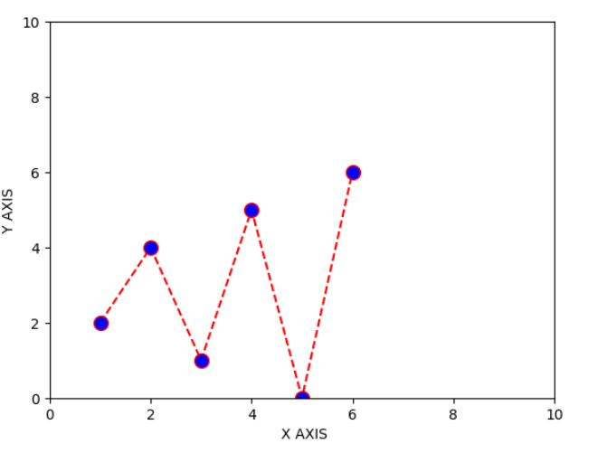

# EXNO-5-DS-DATA VISUALIZATION USING MATPLOT LIBRARY

# Aim:
  To Perform Data Visualization using matplot python library for the given datas.

# EXPLANATION:
Data visualization is the graphical representation of information and data. By using visual elements like charts, graphs, and maps, data visualization tools provide an accessible way to see and understand trends, outliers, and patterns in data.

# Algorithm:
STEP 1:Include the necessary Library.

STEP 2:Read the given Data.

STEP 3:Apply data visualization techniques to identify the patterns of the data.

STEP 4:Apply the various data visualization tools wherever necessary.

STEP 5:Include Necessary parameters in each functions.

# Coding and Output:
```py
import matplotlib.pyplot as plt
x=[0,2,3,4,5]
y=[10,20,25,40,50]
plt.plot(x,y)
plt.show()
```

```py
import matplotlib.pyplot as plt
x=[0,2,3,4,5]
y=[10,20,25,40,50]
plt.xlabel("X axis")
plt.ylabel("Y axis")
plt.plot(x,y,marker='o')
plt.show()
```

```py
x1=[ i for i in range(0,5,1)]
y1=[ i for i in range(10,0,-2)]

x2=[ 2,5,8,9,10]
y2=[10,15,13,45,32]

plt.plot(x1,y1,label="line1",color="r")

plt.plot(x2,y2,label='line2',color='g')

plt.title("comparing two data")
plt.legend()

```

```py
a=[12,15,16,19,25]
b=[20,15,3,10,20]
plt.bar(a,b)
```

```py
a=[1,5,2,2,4,6]
b=[5,1,5,2,5,5]
plt.scatter(a,b,color='g',marker="*")
```

```py
import numpy as np
import matplotlib.pyplot as plt
x = np.arange(0, 4 *np.pi, 0.1)
y = np.sin(x)
plt.title("sine wave form")
# Plot the points using matplotlib
plt.plot(x, y)
plt.show()
```

```py
import matplotlib.pyplot as plt
import numpy as np
# Create some random data
x = [1, 2, 3, 4, 5]
y1 = [10, 12, 14, 16, 18]
y2 = [5, 7, 9, 11, 13]
y3 = [2, 4, 6, 8, 10]
# Create the plot
plt.fill_between(x, y1, color='blue')
plt.fill_between(x, y2, color='green')
plt.plot(x, y1, color='red')
plt.plot(x, y2, color='black')
plt.legend(['y1','y2'])
plt.show()
```

```py
import matplotlib.pyplot as plt
game=['freefire','pubg','clash of clan','canday crush']
popular=[1000,2500,3000,500]
plt.bar(game,popular)

plt.show()

```

```py
import matplotlib.pyplot as plt
game=['freefire','pubg','clash of clan','canday crush']
popular=[5,6,9,2]
plt.barh(popular,game)

plt.show()

```

```py
import matplotlib.pyplot as plt
#generate fake data
x = [2,1,6,4,2,4,8,9,4,2,4,10,6,4,5,7,7,3,2,7,5,3,5,9,2,1]
#plot for a histogram
plt.hist(x, bins = 10, color='blue', alpha=0.5)
plt.show()
```

```py
import matplotlib.pyplot as plt
import numpy as np
np.random.seed (0)
data = np.random.normal(loc=0, scale=1, size=100)
data
```

```py
import matplotlib.pyplot as plt
# defining labels
activities = ['eat', 'sleep', 'work', 'play']
# portion covered by each label
slices = [3, 7, 8, 6]
# color for each label
colors = ['r', 'y', 'g', 'b']
# plotting the pie chart
plt.pie (slices, labels = activities, colors=colors, startangle=90, shadow = True, explode = (0, 0, 0.1, 0), radius = 1.2, autopct = '%1.1f%%')
# plotting legend
plt.legend ()
# showing the plot
plt.show()
```

```py
labels='Python','C++','Ruby','Java'
sizes=[215,130,245,210]
colors=['gold','yellowgreen','lightcoral','lightskyblue']
explode=(0,0.4,0,0.5)
plt.pie(sizes,explode=explode,labels=labels,colors=colors,autopct='%1.1f%%',shadow=True)
plt.axis('equal')
```


# Result:
Thus the program to Perform Data Visualization using matplot python library for the given datas is been implemented.